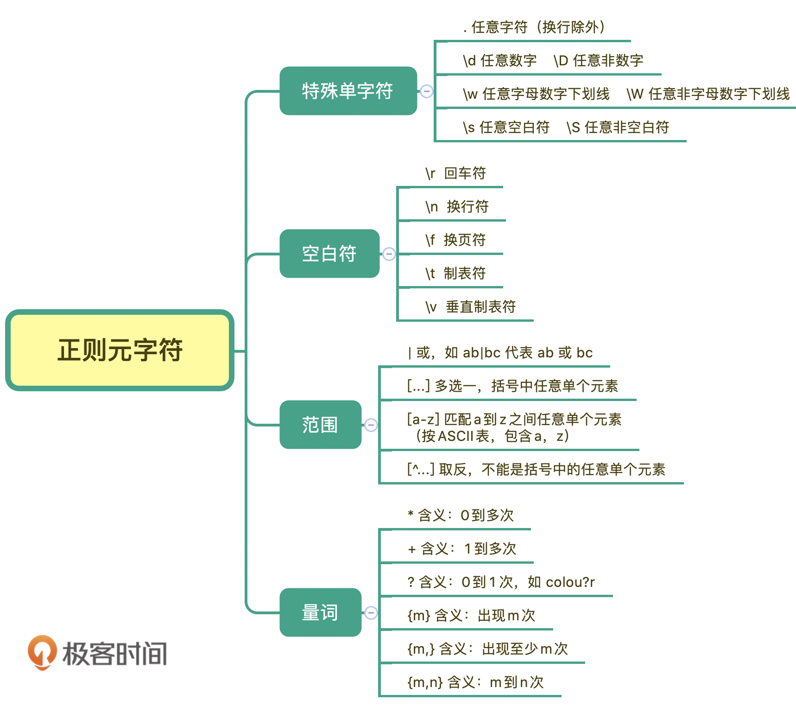
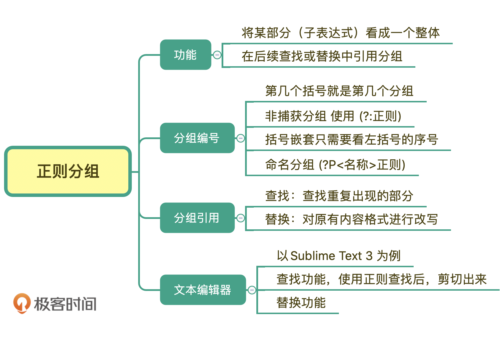
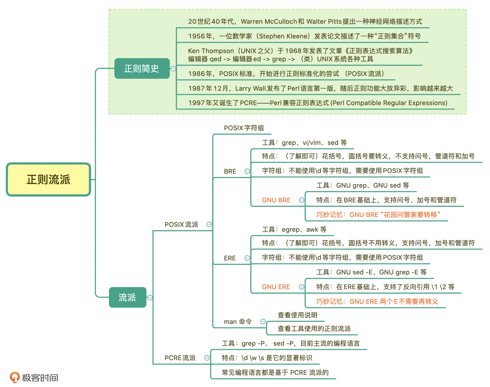
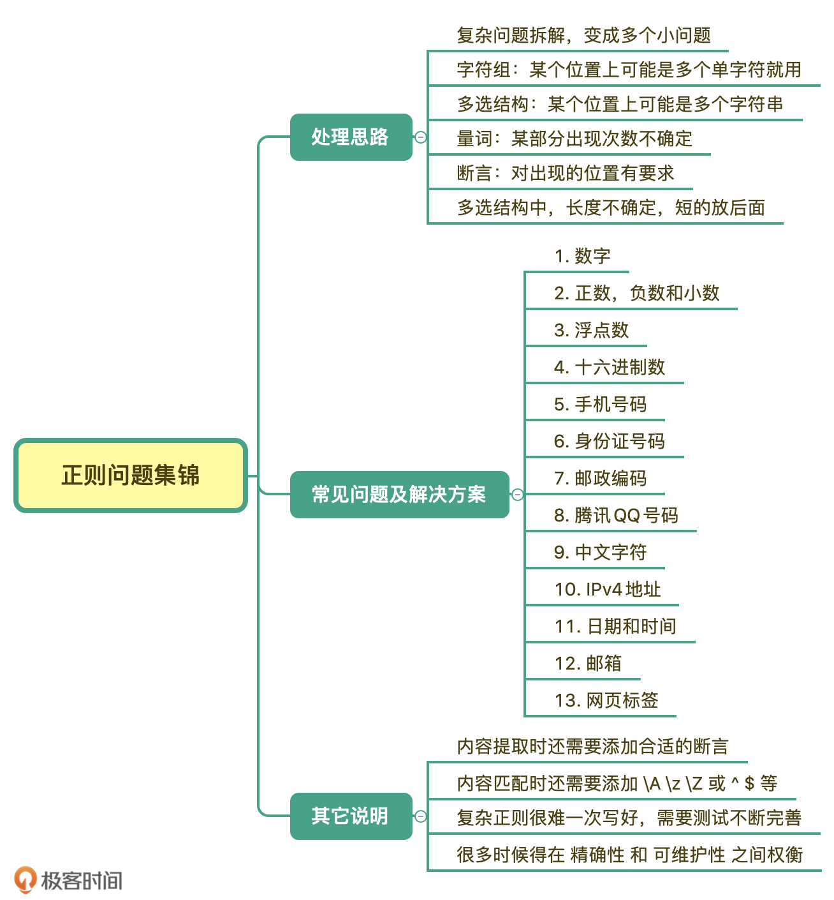

[learn-regex](https://github.com/ziishaned/learn-regex/blob/master/translations/README-cn.md)

[正则表达式30分钟入门教程](http://deerchao.net/tutorials/regex/regex.htm)

[正则表达式检验工具](https://regex101.com/)

