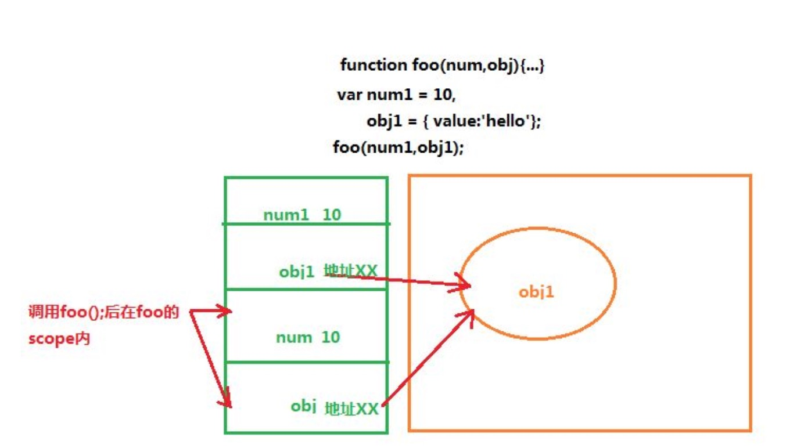

# 2018. 2. 22

## [JavaScript 运行原理解析](https://juejin.im/post/5a5d64fbf265da3e243b831f)

## JS中的prototype
> `JS`支持面向对象编程, 但是ES6之前没有`Class`的概念(ES6引入了`class`关键字), 所以通过`prototype`来实现继承.

先看构造函数: 除了直接用{ ... }创建一个对象外，JavaScript还可以用一种构造函数的方法来创建对象.

```js
function Student(name) {
    this.name = name;
    this.hello = function () {
        alert('Hello, ' + this.name + '!');
    }
}
var xiaoming = new Student('小明');
xiaoming.name; // '小明'
xiaoming.hello(); // Hello, 小明!
```

如果不写new，这就是一个普通函数，它返回undefined。但是，如果写了new，它就变成了一个构造函数，它绑定的this指向新创建的对象，并默认返回this，也就是说，不需要在构造函数最后写return this.

首先构造函数Student有个`prototype`属性, 指向原型对象, 原型对象有个`constructor`属性指向构造函数. 实例xiaoming有个内部属性`[[Prototype]]`指向原型对象. 
xiaoming的原型链:
`xiaoming ----> Student.prototype ----> Object.prototype ----> null`

如果创建多个实例, 所有的实例共享prototype对象(原型对象). 所有实例共享的属性和方法都存放在原型对象中.

**关于`prototype`和`__proto__`:**

* 对于所有的对象，都有`__proto__`属性，这个属性对应该对象的原型
* 对于函数对象，除了`__proto__`属性之外，还有`prototype`属性，当一个函数被用作构造函数来创建实例时，该函数的prototype属性值将被作为原型赋值给所有对象实例(也就是设置实例的__proto__属性).


## 构造函数中的“this”
JavaScript没有特定的构造函数。我们所能做的就是使用 new运算符将函数调用转换为构造函数调用，如上面所示。
构造函数被调用时，会创建一个新对象并将其设置为函数的 `this`参数。构造函数会隐式的返回这个对象，除非我们明确的返回了另外一个对象。

函数对象的定义是：具有[[call]]私有字段的对象.
构造器对象的定义是：具有私有字段[[construct]]的对象。

我们可以这样说，任何对象只需要实现[[call]]，它就是一个函数对象，可以去作为函数被调用。而如果它能实现[[construct]]，它就是一个构造器对象，可以作为构造器被调用。对于用户使用 function 语法或者Function构造器创建的对象来说，[[call]]和[[construct]]行为总是相似的，它们执行同一段代码。大致可以认为，它们[[construct]]的执行过程如下：

* 以 Object.protoype 为原型创建一个新对象；
* 以新对象为 this，执行函数的[[call]]；
* 如果[[call]]的返回值是对象，那么，返回这个对象，否则返回第一步创建的新对象。


参考: [[译] JavaScript中的“this”是什么？](https://juejin.im/post/5b6676e6f265da0fa00a3a12)


## String

### 字符串格式化:
    js: `$()`
    swift: `\( )`
    py: `%( )`
    
### 字符串是不可变的

 
> `py`中也有这种特性.

### 取指定位置字符串
 

> `swift` 和 `py` 中可以 `..<`等操作符

## 对象


## iterable
关于`for...in` 和 `for...of`


## 解构赋值


* 这一点`py`中也是支持的, 不过`py`不支持解构嵌套. 参考: [写给 Python 程序员看的 ECMAScript 6 介绍](https://github.com/kxxoling/blog/blob/master/js/py-es6.md)
* **`解构赋值`可以忽略一些元素, 也可以嵌套, 还可以从一个对象中取出某些属性, 解构赋值还可以使用默认值**


## apply函数


## 装饰器

**疑问:** 这个例子为什么要利用`apply`? 直接调用`oldParseInt()`不可以吗???

## 高阶函数
* `map`
* `reduce`
* `filter`
* `sort`

## sort函数


## 闭包
参考: [MDN web docs - 闭包](https://developer.mozilla.org/zh-CN/docs/Web/JavaScript/Closures)
### 介绍
闭包是`函数`和声明该函数的`词法环境`的组合.
每个闭包都有它自己的词法环境.

```js
var makeCounter = function() {
  var privateCounter = 0;
  function changeBy(val) {
    privateCounter += val;
  }
  return {
    increment: function() {
      changeBy(1);
    },
    decrement: function() {
      changeBy(-1);
    },
    value: function() {
      return privateCounter;
    }
  }  
};

var Counter1 = makeCounter();
var Counter2 = makeCounter();
console.log(Counter1.value()); /* logs 0 */
Counter1.increment();
Counter1.increment();
console.log(Counter1.value()); /* logs 2 */
Counter1.decrement();
console.log(Counter1.value()); /* logs 1 */
console.log(Counter2.value()); /* logs 0 */  //每个闭包都是引用自己词法作用域内的变量 privateCounter, 互不影响.
```

**需要注意的是: 闭包词法作用域中捕获的变量, 是在闭包(函数)执行时才被确定的.**

```js
<p id="help">Helpful notes will appear here</p>
<p>E-mail: <input type="text" id="email" name="email"></p>
<p>Name: <input type="text" id="name" name="name"></p>
<p>Age: <input type="text" id="age" name="age"></p>

function showHelp(help) {
  document.getElementById('help').innerHTML = help;
}

function setupHelp() {
  var helpText = [
      {'id': 'email', 'help': 'Your e-mail address'},
      {'id': 'name', 'help': 'Your full name'},
      {'id': 'age', 'help': 'Your age (you must be over 16)'}
    ];

  for (var i = 0; i < helpText.length; i++) {
    var item = helpText[i];
    document.getElementById(item.id).onfocus = function() {
      showHelp(item.help);
    }
  }
}

setupHelp();
```
这三个闭包在循环中被创建，但他们共享了同一个词法作用域，在这个作用域中存在一个变量item。当onfocus的回调执行时，item.help的值被决定。由于循环在事件触发之前早已执行完毕，变量对象item（被三个闭包所共享）已经指向了helpText的最后一项。

解决这个问题的一种方案:

1. 使用更多的闭包, 可用函数工厂：

```js
function showHelp(help) {
  document.getElementById('help').innerHTML = help;
}

function makeHelpCallback(help) {
  return function() {
    showHelp(help);
  };
}

function setupHelp() {
  var helpText = [
      {'id': 'email', 'help': 'Your e-mail address'},
      {'id': 'name', 'help': 'Your full name'},
      {'id': 'age', 'help': 'Your age (you must be over 16)'}
    ];

  for (var i = 0; i < helpText.length; i++) {
    var item = helpText[i];
    document.getElementById(item.id).onfocus = makeHelpCallback(item.help); //调用makeHelpCallback 函数为每一个回调创建一个新的词法环境.
  }
}

setupHelp();
```

2. 使用匿名闭包, 马上把当前循环项的item与事件回调相关联起来.

```
function showHelp(help) {
  document.getElementById('help').innerHTML = help;
}

function setupHelp() {
  var helpText = [
      {'id': 'email', 'help': 'Your e-mail address'},
      {'id': 'name', 'help': 'Your full name'},
      {'id': 'age', 'help': 'Your age (you must be over 16)'}
    ];

  for (var i = 0; i < helpText.length; i++) {
    (function() {
       var item = helpText[i];
       document.getElementById(item.id).onfocus = function() {
         showHelp(item.help);
       }
    })(); // 马上把当前循环项的item与事件回调相关联起来
  }
}

setupHelp();
```

3. 使用`let`关键字. 使用let而不是var，因此每个闭包都绑定了块作用域的变量，这意味着不再需要额外的闭包。

```
function showHelp(help) {
  document.getElementById('help').innerHTML = help;
}

function setupHelp() {
  var helpText = [
      {'id': 'email', 'help': 'Your e-mail address'},
      {'id': 'name', 'help': 'Your full name'},
      {'id': 'age', 'help': 'Your age (you must be over 16)'}
    ];

  for (var i = 0; i < helpText.length; i++) {
    let item = helpText[i];
    document.getElementById(item.id).onfocus = function() {
      showHelp(item.help);
    }
  }
}

setupHelp();
```

### 一般作用
* 延迟执行


**返回闭包时牢记的一点就是：返回函数不要引用任何循环变量，或者后续会发生变化的变量.**


*  封装私有变量:


*  把多参数的函数变成单参数的函数. 

### 闭包性能考量
如果不是某些特定任务需要使用闭包，在其它函数中创建函数是不明智的，因为闭包在处理速度和内存消耗方面对脚本性能具有负面影响. 

例如，在创建新的对象或者类时，方法通常应该关联于对象的原型，而不是定义到对象的构造器中。原因是这将导致每次构造器被调用时，方法都会被重新赋值一次（也就是，每个对象的创建）。

考虑以下示例：

```
function MyObject(name, message) {
  this.name = name.toString();
  this.message = message.toString();
  this.getName = function() {
    return this.name;
  };

  this.getMessage = function() {
    return this.message;
  };
}
```
在上面的代码中，我们并没有利用到闭包的好处，因此可以避免使用闭包。修改成如下：

```
function MyObject(name, message) {
  this.name = name.toString();
  this.message = message.toString();
}
MyObject.prototype.getName = function() {
  return this.name;
};
MyObject.prototype.getMessage = function() {
  return this.message;
};

// 不建议下面这种重新定义原型的写法:
MyObject.prototype = {
  getName: function() {
    return this.name;
  },
  getMessage: function() {
    return this.message;
  }
};
```


## 箭头函数
* 箭头函数相当于匿名函数，并且简化了函数定义。箭头函数有两种格式，一种像下面的，只包含一个表达式，连{ ... }和return都省略掉了。还有一种可以包含多条语句，这时候就不能省略{ ... }和return：
* 如果参数不是一个，就需要用括号()括起来


###  注意`this`在箭头函数中的使用:
箭头函数看上去是匿名函数的一种简写，但实际上，箭头函数和匿名函数有个明显的区别：箭头函数内部的this是词法作用域，由上下文确定。

回顾前面的例子，由于JavaScript函数对this绑定的错误处理，下面的例子无法得到预期结果：

```
var obj = {
    birth: 1990,
    getAge: function () {
        var b = this.birth; // 1990
        var fn = function () {
            return new Date().getFullYear() - this.birth; // this指向window或undefined
        };
        return fn();
    }
};
```

现在，箭头函数完全修复了this的指向，this总是指向词法作用域，也就是外层调用者obj：

```
var obj = {
    birth: 1990,
    getAge: function () {
        var b = this.birth; // 1990
        var fn = () => new Date().getFullYear() - this.birth; // this指向obj对象
        return fn();
    }
};
obj.getAge(); // 25
```

如果使用箭头函数，以前的那种hack写法：`var that = this;`就不再需要了。

由于this在箭头函数中已经按照词法作用域绑定了，所以，用call()或者apply()调用箭头函数时，无法对this进行绑定，即传入的第一个参数被忽略.

## generator
`js`中的`generator`借鉴了`Python`的`generator`的概念和语法.
#### `generator`和普通函数相比作用:
    * 因为generator可以在执行过程中多次返回，所以它看上去就像一个可以记住执行状态的函数，利用这一点，写一个generator就可以实现需要用面向对象才能实现的功能。例如，用一个对象来保存状态.
    * generator还有另一个巨大的好处，就是把异步回调代码变成“同步”代码. 这个好处要等到后面学了AJAX以后才能体会到。

## 关于堆栈的对比


## `值类型`和`引用类型`
### 基本类型
* JavaScript 中共有 6 种基本数据类型：Undefined、Null、Boolean、Number、String、Symbol (new in ES 6) ！
* 基本数据类型的值是按值访问的。
* 基本类型的值是不可变的.
* 基本类型的比较是它们的值的比较.
* 基本类型的变量是存放在栈内存（Stack）里的

### 引用类型
* 除过上面的 6 种基本数据类型外，剩下的就是引用类型了，统称为 Object 类型。细分的话，有：Object 类型、Array 类型、Date 类型、RegExp 类型、Function 类型 等。
* 引用类型的值是按引用访问的.
* 引用类型的值是可变的.
* 引用类型的比较是引用的比较.
* 引用类型的值是保存在堆内存（Heap）中的对象（Object).

### 检测类型
* `typeof`：经常用来检测一个变量是不是最基本的数据类型.
* `instanceof`：用来判断某个构造函数的 prototype 属性所指向的对象是否存在于另外一个要检测对象的原型链上. 简单说就是判断一个引用类型的变量具体是不是某种类型的对象.

### 函数传值
ECMAScript中所有函数的参数都是按**值**来传递的.  对象参数的传递, 传递的是保存对象所在地址的变量(值为对象在堆中的地址). 而不是对象本身. 这点跟oc一样.



```
var obj1 = {
  value:'111'
};
 
var obj2 = {
  value:'222'
};
 
function changeStuff(obj){  
  obj.value = '333';    //可以修改obj.value的值
  obj = obj2;   //这句直接将obj变量所装的地址修改为了obj2中装的地址
  return obj.value;
}

var foo = changeStuff(obj1);    
```

## export default
[export default 命令](http://es6.ruanyifeng.com/?search=import&x=0&y=0#docs/module#export-default-%E5%91%BD%E4%BB%A4)

