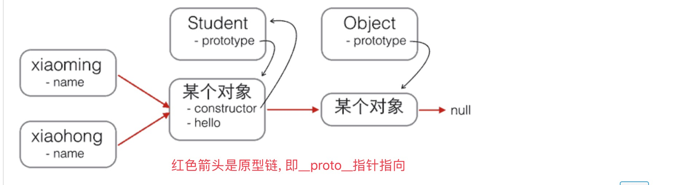

# 2018. 2. 22

## [JavaScript 运行原理解析](https://juejin.im/post/5a5d64fbf265da3e243b831f)

## JS中的prototype
> `JS`支持面向对象编程, 但是又没有`Class`的概念, 所以通过`prototype`来实现继承.

先看构造函数: 除了直接用{ ... }创建一个对象外，JavaScript还可以用一种构造函数的方法来创建对象.

```js
function Student(name) {
    this.name = name;
    this.hello = function () {
        alert('Hello, ' + this.name + '!');
    }
}
var xiaoming = new Student('小明');
xiaoming.name; // '小明'
xiaoming.hello(); // Hello, 小明!
```

如果不写new，这就是一个普通函数，它返回undefined。但是，如果写了new，它就变成了一个构造函数，它绑定的this指向新创建的对象，并默认返回this，也就是说，不需要在构造函数最后写return this.

首先构造函数Student有个`prototype`属性, 指向原型对象, 原型对象有个`constructor`属性指向构造函数. 实例xiaoming有个内部属性`[[Prototype]]`指向原型对象. 
xiaoming的原型链:
`xiaoming ----> Student.prototype ----> Object.prototype ----> null`

如果创建多个实例, 所有的实例共享prototype对象(原型对象). 所有实例共享的属性和方法都存放在原型对象中.

**关于`prototype`和`__proto__`:**

* 对于所有的对象，都有`__proto__`属性，这个属性对应该对象的原型
* 对于函数对象，除了`__proto__`属性之外，还有`prototype`属性，当一个函数被用作构造函数来创建实例时，该函数的prototype属性值将被作为原型赋值给所有对象实例(也就是设置实例的__proto__属性).



## String

### 字符串格式化:
    js: `$()`
    swift: `\( )`
    py: `%( )`
    
### 字符串是不可变的

 
> `py`中也有这种特性.

### 取指定位置字符串
 

> `swift` 和 `py` 中可以 `..<`等操作符

## 对象


## iterable
关于`for...in` 和 `for...of`


## 解构赋值


* 这一点`py`中也是支持的, 不过`py`不支持解构嵌套. 参考: [写给 Python 程序员看的 ECMAScript 6 介绍](https://github.com/kxxoling/blog/blob/master/js/py-es6.md)
* **`解构赋值`可以忽略一些元素, 也可以嵌套, 还可以从一个对象中取出某些属性, 解构赋值还可以使用默认值**


## apply函数


## 装饰器

**疑问:** 这个例子为什么要利用`apply`? 直接调用`oldParseInt()`不可以吗???

## 高阶函数
* `map`
* `reduce`
* `filter`
* `sort`

## sort函数


## 闭包
* 返回函数会延迟执行.
* 封装私有变量.
* 把多参数的函数变成单参数的函数

### 延迟执行


**返回闭包时牢记的一点就是：返回函数不要引用任何循环变量，或者后续会发生变化的变量.**


### 封装私有变量:


### 把多参数的函数变成单参数的函数. (好像没卵用吧???)

## 箭头函数
* 箭头函数相当于匿名函数，并且简化了函数定义。箭头函数有两种格式，一种像下面的，只包含一个表达式，连{ ... }和return都省略掉了。还有一种可以包含多条语句，这时候就不能省略{ ... }和return：
* 如果参数不是一个，就需要用括号()括起来


###  注意`this`在箭头函数中的使用:
箭头函数看上去是匿名函数的一种简写，但实际上，箭头函数和匿名函数有个明显的区别：箭头函数内部的this是词法作用域，由上下文确定。

回顾前面的例子，由于JavaScript函数对this绑定的错误处理，下面的例子无法得到预期结果：

```
var obj = {
    birth: 1990,
    getAge: function () {
        var b = this.birth; // 1990
        var fn = function () {
            return new Date().getFullYear() - this.birth; // this指向window或undefined
        };
        return fn();
    }
};
```

现在，箭头函数完全修复了this的指向，this总是指向词法作用域，也就是外层调用者obj：

```
var obj = {
    birth: 1990,
    getAge: function () {
        var b = this.birth; // 1990
        var fn = () => new Date().getFullYear() - this.birth; // this指向obj对象
        return fn();
    }
};
obj.getAge(); // 25
```

如果使用箭头函数，以前的那种hack写法：`var that = this;`就不再需要了。

由于this在箭头函数中已经按照词法作用域绑定了，所以，用call()或者apply()调用箭头函数时，无法对this进行绑定，即传入的第一个参数被忽略.

## generator
`js`中的`generator`借鉴了`Python`的`generator`的概念和语法.
#### `generator`和普通函数相比作用:
    * 因为generator可以在执行过程中多次返回，所以它看上去就像一个可以记住执行状态的函数，利用这一点，写一个generator就可以实现需要用面向对象才能实现的功能。例如，用一个对象来保存状态.
    * generator还有另一个巨大的好处，就是把异步回调代码变成“同步”代码. 这个好处要等到后面学了AJAX以后才能体会到。

## 关于堆栈的对比


## `值类型`和`引用类型`
### 基本类型
* JavaScript 中共有 6 种基本数据类型：Undefined、Null、Boolean、Number、String、Symbol (new in ES 6) ！
* 基本数据类型的值是按值访问的。
* 基本类型的值是不可变的.
* 基本类型的比较是它们的值的比较.
* 基本类型的变量是存放在栈内存（Stack）里的

### 引用类型
* 除过上面的 6 种基本数据类型外，剩下的就是引用类型了，统称为 Object 类型。细分的话，有：Object 类型、Array 类型、Date 类型、RegExp 类型、Function 类型 等。
* 引用类型的值是按引用访问的.
* 引用类型的值是可变的.
* 引用类型的比较是引用的比较.
* 引用类型的值是保存在堆内存（Heap）中的对象（Object).

### 检测类型
* `typeof`：经常用来检测一个变量是不是最基本的数据类型.
* `instanceof`：用来判断某个构造函数的 prototype 属性所指向的对象是否存在于另外一个要检测对象的原型链上. 简单说就是判断一个引用类型的变量具体是不是某种类型的对象.


